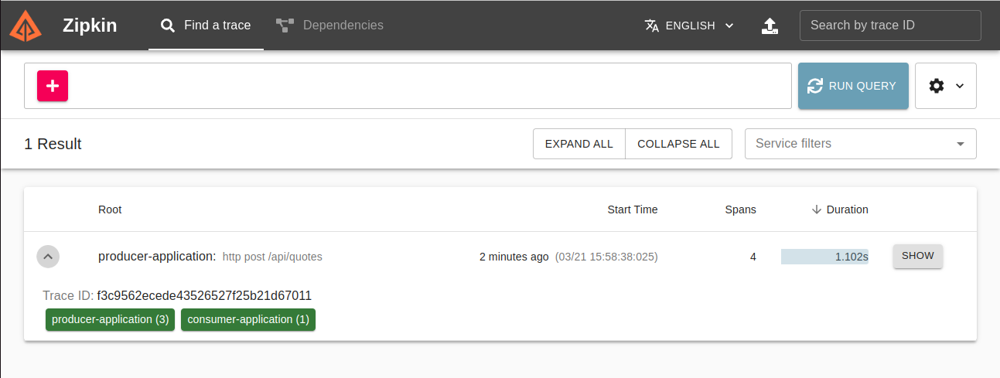
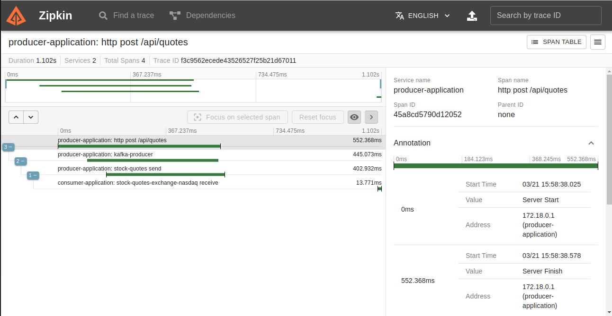
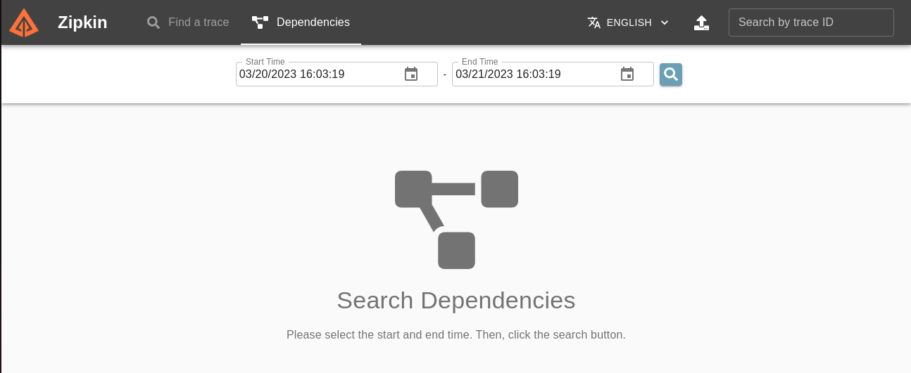

# Spring Kafka Streams Tracing issue

## Context

At the moment I'm migrating some Spring Boot 2.7.x, Spring for Apache Kafka applications to Spring Boot 3.

I followed the migration guide and Spring Kafka documentation regarding Spring Cloud Sleuth and Micrometer Tracing 
* https://docs.spring.io/spring-kafka/reference/html/#observation-gen
* https://github.com/spring-cloud/spring-cloud-release/wiki/Spring-Cloud-2022.0-Release-Notes
* https://github.com/micrometer-metrics/tracing/wiki/Spring-Cloud-Sleuth-3.1-Migration-Guide

Distributed tracing works fine for:
* producing to Kafka (by enabling observation on the KafkaTemplate) 
* and consuming from Kafka (by enabling observation via the container properties of the KafkaListenerContainerFactory) 

But for Kafka streams application (using the `KafkaStreamBrancher` see [KafkaStreamsConfig.java](spring-kafka-streams/src/main/java/nl/jtim/kafka/streams/config/KafkaStreamsConfig.java)) the tracing is no longer working after the upgrade.

|                                               | Tracing producer working? | Tracing consumer working? | Tracing Kafka Streams working? | Dependencies shown in Zipkin? |
|-----------------------------------------------|---------------------------|---------------------------|--------------------------------|-------------------------------|
| Spring Boot 2.7.x + Spring Cloud Sleuth       | Y                         | Y                         | Y                              | Y                             |
| Spring Boot 3.0.x + Micrometer Tracing (OTEL) | Y                         | Y                         | N                              | N                             |

## Branches

* `main`: 
  * Spring Boot 3.0.4
  * Spring Cloud: 2021.0.6
  * Spring for Apache Kafka: 
  * Micrometer Tracing (Open Telemetry + Zipkin)
* `spring-boot-2.7-spring-cloud-sleuth`: 
  * Spring Boot 2.7.9
  * Spring Cloud: 2021.0.6
  * Spring for Apache Kafka: 2.8.11 
  * Spring Cloud Sleuth

## Project setup

Small project to reproduce issues with distributed tracing for Kafka streams.

* `spring-kafka-producer`: simple producer, exposes a REST API to produce a message to Kafka
* `spring-kafka-streams`: simple stream application branching to different topic
* `spring-kafka-consumer`: simple consumer consuming from different topics

## Build the project

```bash
./mvn clean install
```

## Start the project

First start a single node Kafka cluster, Zookeeper, Schema Registry and Zipkin

```bash
docker-compose up -d
```

Run the producer application:

```bash
./mvnw -pl spring-kafka-producer spring-boot:run 
```

Run the kafka streams application:

```bash
./mvnw -pl spring-kafka-streams spring-boot:run 
```

Run the consumer application:

```bash
./mvnw -pl spring-kafka-consumer spring-boot:run 
```

## Produce a message

Via the simple Rest API of the producer application we can produce a message on Kafka:

```bash
curl -v -X POST http://localhost:8080/api/quotes -H 'Content-Type: application/json' -d '{
  "symbol": "TSLA",
  "exchange": "NASDAQ",
  "tradeValue": "183.25",
  "currency": "USD",
  "description": "TSLA Stock"
}'
```

## Show traces in Zipkin

Open the Zipkin UI [http://localhost:9411/zipkin/](http://localhost:9411/zipkin/) and click the button 'RUN QUERY'

For both the producer and consumer application traces are reported to Zipkin.
But for the Kafka Streams application distributed tracing doesn't seems to work and no traces are send to Zipkin.





Also, the dependency view is empty 

[Zipkin Dependencies view](http://localhost:9411/zipkin/dependency)

